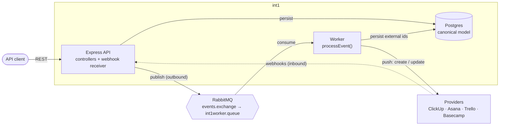
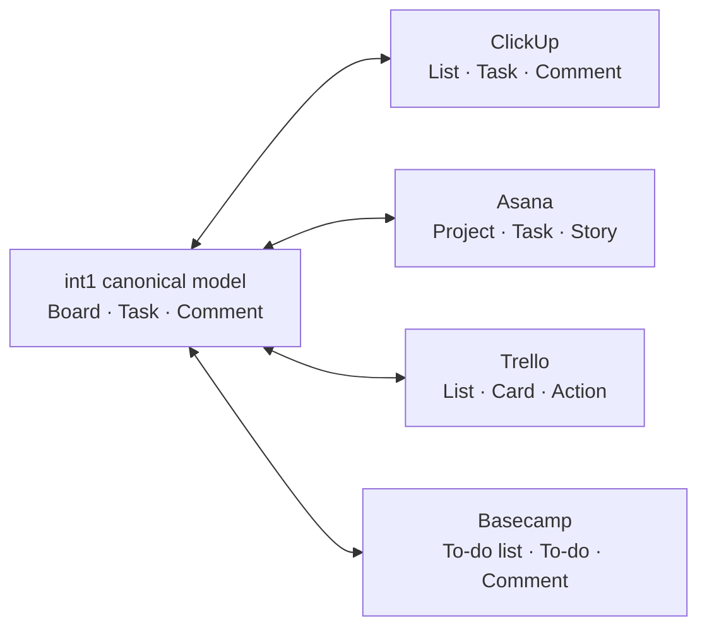
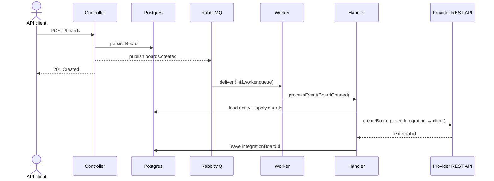
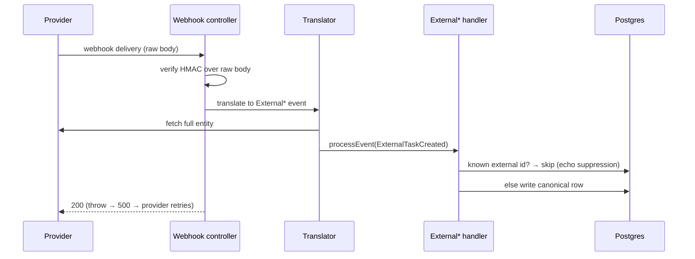

# int1 - Aggregator for Project Management Tools

**A unified integration layer that mirrors four project-management tools — ClickUp,
Asana, Trello, and Basecamp — into one canonical model, bidirectionally, over a
message broker.**

[](https://github.com/shrirambalakrishnan/int1/actions/workflows/test.yml)


Teams pick different project-management tools, which fragments visibility for anyone
who needs the whole picture. int1 is the aggregator: it keeps one canonical
Board/Task/Comment model in Postgres in sync with each external tool **in both
directions** — local changes are pushed out to the provider, and changes made _in_ the
provider flow back through webhooks — so the aggregate stays current no matter where the
edit happens.

This is an API-only service (no UI, no auth yet).

---

## Domain model

int1's canonical entities

| Entity  | Description                                         |
| ------- | --------------------------------------------------- |
| Board   | A collection of tasks, typically owned by one team. |
| Task    | A unit of work on a board, assignable to a User.    |
| Comment | An update added to a Task by a User.                |

Each integration maps its own terminology onto this schema as
part of its integration plan.

---

## High Level Design (HLD)



Every provider maps its own vocabulary onto **one** canonical model:



---

### Key Points

- **Event-driven + broker-decoupled.**
  - Controllers persist, then publish a typed event
  - RabbitMQ worker does the external push, so the API never blocks on a provider.
- **Bidirectional sync**
  - Outbound flow uses REST API integrations
  - Inbound flow uses webhooks integration
  - Both become canonical events through a single `processEvent()`
- **Pluggable auth behind one interface.**
  - Supported authentication mechanisms
    - Static Token (API Key / Personal Token)
    - OAuth2
  - Both authentication mechanisms sit behind the same `getAuthHeaders()` — adding an auth type doesn't touch client code.
- **Idempotent + self-echo-suppressing.**
  - Sync keys on the external id, so redeliveries of webhooks are safe
  - Provider's echo of our own push is absorbed — no separate de-dupe.
- **Provider-agnostic contract.**
  - Every provider is the same six operations (create/update ×
    Board/Task/Comment);
- **Tested + CI.**
  - Unit-tested across handlers, clients, translators, and auth strategies
  - Runs on every PR (GitHub Actions).

Design rationale for the bigger calls lives in [`DECISIONS.md`](DECISIONS.md) (append-only
ADR log) and [`CLAUDE.md`](CLAUDE.md).

---

## Low Level Design (LLD)

### Outbound — a local change reaches the external tool



The `npm run emit:*` scripts call `processEvent` directly as a broker-free way to drive a
single event by hand.

### Inbound — a change in the provider flows back



Guards are the same on both sides — they just decide skip vs. write vs. retry:

| Situation                                       | Behavior                                            |
| ----------------------------------------------- | --------------------------------------------------- |
| Entity already integrated (Created redelivered) | **Skip** — idempotent, retry-safe, echo-suppressing |
| Update event for a never-integrated entity      | **Skip** — creation is the Created event's job      |
| Created event but parent not integrated yet     | **Throw** — loud now, becomes broker redelivery     |

External ids (`integrationBoardId`, `integrationTaskId`, `integrationCommentId`,
`externalUserId`) are **opaque strings** — providers use alphanumeric and >32-bit ids.

---

## Integrations

| Provider     | Outbound&nbsp;push&nbsp;¹ | Inbound webhook         | Auth                             | 429 handling             | Details                            |
| ------------ | :-----------------------: | ----------------------- | -------------------------------- | ------------------------ | ---------------------------------- |
| **ClickUp**  |            ✅             | ✅ space-scoped         | static token                     | wait `X-RateLimit-Reset` | [docs](docs/providers/clickup.md)  |
| **Asana**    |            ✅             | ✅ per-project, batched | static token (`Bearer`)          | wait `Retry-After`       | [docs](docs/providers/asana.md)    |
| **Trello**   |            ✅             | ✅ board-level          | key + token (OAuth 1.0a header)  | fixed 10 s window        | [docs](docs/providers/trello.md)   |
| **Basecamp** |            ✅             | —                       | **OAuth2** (auth-code + refresh) | —                        | [docs](docs/providers/basecamp.md) |
| _stub_       |            ✅             | —                       | none (synthetic ids)             | —                        | —                                  |

¹ Outbound push = all six canonical operations (`create`/`update` × `Board`/`Task`/`Comment`).

Each provider maps its own resources onto int1's Board/Task/Comment — e.g. ClickUp
List/Task/Comment, Asana Project/Task/Story, Trello List/Card/Action, Basecamp
to-do-list/to-do/comment. The per-provider docs cover the resource mapping, exact
endpoints, webhook signature scheme, rate limits, and registration steps.

---

## Authentication

Authentication is pluggable per provider via strategies (`src/integration/auth/`),
resolved through `selectAuthStrategy`. Every strategy exposes the same **async**
`getAuthHeaders()` seam, so client call sites are identical regardless of how credentials
are obtained — and clients/strategies stay **DB-free** (callers pass the token in).

- **`token`** — static API token. One strategy covers three header shapes via a `scheme`
  option: bare (ClickUp), `Bearer` (Asana), and an `OAuth` 1.0a-style header (Trello).
- **`oauth2`** — OAuth2 authorization-code flow with **proactive refresh**: it renews an
  expiring bearer token behind the same `getAuthHeaders()` seam, without touching clients.
  Basecamp 4 is the first OAuth2 provider — picked because it is OAuth2-_only_, which
  forces the path a static token never exercises. The strategy is handed the current
  tokens plus `refresh`/`persist` closures, so a mid-call refresh is saved; per-connection
  tokens live in the database as domain state, never as config. Full flow, draft-5 quirks,
  and config homes are in the [Basecamp doc](docs/providers/basecamp.md).

`getAuthHeaders()` is async on purpose — the interface had to fit OAuth refresh from the
start.

---

## Running it

Prerequisites: **Node 26.2** (see `.nvmrc`), **Postgres**, **RabbitMQ**.

```bash
npm install

# The Sequelize CLI reads paths from .sequelizerc. Source .env first — the DB name is
# built from it (DB name = ${DB_NAME}_${ENV}, e.g. int1_dev).
set -a; . ./.env; set +a
npx sequelize-cli db:migrate

npm start             # API — publishes events on create/update
npm run start:worker  # worker (separate shell) — consumes int1worker.queue → processEvent
npm test              # unit tests (node --test)
```

The broker topology (exchange, queue, bindings) is asserted idempotently at startup by
**both** processes, so start order doesn't matter. Any command that actually talks to a
provider also needs that provider's secret exported first — see below.

Copy `.env.example` to `.env` for the non-secret config (DB connection, `RABBITMQ_URL`,
the per-provider ids like `CLICKUP_SPACE_ID`).

---

## Secrets

Secrets (API tokens, client secrets, webhook keys) are **never stored in `.env` or any
file in the repo** — `.env` holds only non-secret config. In development they live in the
**macOS Keychain**, managed with the built-in `security` CLI, where the Keychain _service
name_ is exactly the env var name the code expects, so the mapping is self-documenting.
The app just reads `process.env`; it neither knows nor cares where the value came from, so
any secret manager that populates the environment works in other environments.

```bash
security add-generic-password -U -a "$USER" -s "CLICKUP_API_TOKEN" -w   # store (prompts; -U overwrites)
security find-generic-password -a "$USER" -s "CLICKUP_API_TOKEN" -w     # read
security delete-generic-password -a "$USER" -s "CLICKUP_API_TOKEN"      # delete
```

Then export before starting the app (alongside sourcing `.env`):

```bash
set -a; . ./.env; set +a
export CLICKUP_API_TOKEN=$(security find-generic-password -a "$USER" -s CLICKUP_API_TOKEN -w)
npm start
```

### Secrets required by the running process

Only the secrets for the providers you actually exercise need to be present.

| Env var / Keychain service | Used by         | Purpose                                                        |
| -------------------------- | --------------- | -------------------------------------------------------------- |
| `CLICKUP_API_TOKEN`        | ClickUp         | Personal API token (`pk_…`) for outbound push                  |
| `ASANA_API_TOKEN`          | Asana           | Personal Access Token for outbound push                        |
| `TRELLO_API_KEY`           | Trello          | API key (identifies the app)                                   |
| `TRELLO_API_TOKEN`         | Trello          | User token (`ATTA…`)                                           |
| `BASECAMP_CLIENT_SECRET`   | Basecamp        | OAuth2 client secret (authorization-code flow + token refresh) |
| `CLICKUP_WEBHOOK_SECRET`   | ClickUp inbound | HMAC secret for verifying inbound webhooks                     |
| `ASANA_WEBHOOK_SECRET`     | Asana inbound   | HMAC secret (delivered via registration handshake)             |
| `TRELLO_API_SECRET`        | Trello inbound  | App secret for verifying `X-Trello-Webhook` (SHA1)             |

Where each value comes from (token pages, registration handshakes) is documented in the
relevant [provider doc](docs/providers/).

---

## Scope & trade-offs

What's deliberately _not_ built yet, and why — the boundaries are intentional, each with a
defined trigger to revisit (see [`DECISIONS.md`](DECISIONS.md)):

- **Outbound flow handles only the happy path on purpose.**
  - The worker auto-acks, so a handler throw currently drops the message
    - Planned solution
      - manual ack/nack
      - retry/backoff
      - dead-letter queue
  - Publish happens after the DB commit and isn't transactional, so a broker outage can persist a row whose event never published;
    - Planned solution
      - reconciliation of all entities with null-external-id columns
- **Inbound webhooks run inline.**
  - The receiver awaits `processEvent` and the provider's own retry plays the broker-redelivery role
  - when RabbitMQ fronts inbound too, it becomes verify → translate → publish → ack and a nack replaces the 500-as-retry.
- **No workflow engine — by choice.**
  - A workflow engine only earns its keep once progress can't live on a normal row
  - Currently the DB rows can track the state of sync
- **Per-entity gaps**: assignee/user mapping, status sync, and delete propagation are
  deferred across providers.

---

## License

Released under the [MIT License](LICENSE) — free to use, fork, and learn from, with
attribution.
